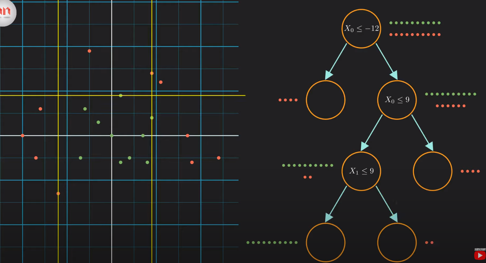

# Decision Tree Classification

Decision trees are supervised learning algorithms used to classify data by asking a series of logical questions.

## Core Concept
The goal is to classify data points (for example, red and green dots) by recursively splitting the dataset based on specific features.
Yes, I can certainly do that! Using **Markdown links** with the specific timestamps makes your documentation much more interactive, as clicking them will take you directly to that exact moment in the video.

### Structure of the Tree
* **Decision Nodes:** These represent conditions or questions e.g $X_0 \leq -12$?$
* **Leaf Nodes:** The final "branches" that provide the classification outcome.
* **Paths:**
    * Exit to the **Left**: Represents **Yes / True** (condition met).
    * Exit to the **Right**: Represents **No / False** (condition not met) .

## Finding the Best Split: Information Gain
Since there are many possible ways to split data, the algorithm must identify the "best" one. It does this by maximizing **Information Gain**.

### Entropy (Measuring Uncertainty)
Entropy is used to quantify the impurity or uncertainty within a group of data.

* **Entropy = 1:** Highest uncertainty (e.g., a 50/50 mix of red and green dots).
* **Entropy = 0:** Perfectly classified data. This is known as a **Pure Node**.

### Calculating Information Gain
To decide which feature to split on, the algorithm subtracts the entropy of the "child" nodes from the entropy of the "parent" node:

$$
\text{Information Gain} = \text{Entropy (Parent)} - \text{Weighted Entropy (Children)}
$$

The model traverses every possible feature and value to find the split that results in the highest Information Gain.

!!! note "Greedy Algorithm"
    The Decision Tree is a **greedy algorithm**. It makes the best possible choice at each step (locally optimal) but does not backtrack to change previous decisions.

---
**Source:** [Decision Tree Classification Clearly Explained!](https://www.youtube.com/watch?v=ZVR2Way4nwQ)