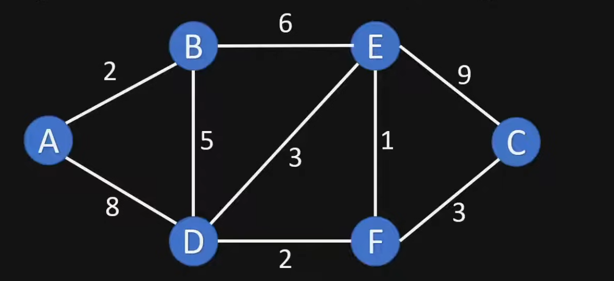

# Dijkstra's Shortest Path Algorithm

Dijkstra's algorithm is a fundamental graph theory algorithm used to find the shortest path from a starting node (the source) to all other nodes in a weighted graph.

## Core Concept
The algorithm works by maintaining a record of the shortest distance discovered so far for each node. It can be applied to digital mapping, where nodes represent cities and edges represent the roads and distances between them.

### Key Data Structures
To track the progress, the algorithm uses:
* **Unvisited List:** A list containing all nodes that haven't been fully processed yet.
* **Distance Table:** A table tracking:
    * The current **Shortest Distance** from the source to each node.
    * The **Previous Node** that led to that shortest distance (used to reconstruct the path later).

## Step-by-Step Process

### 1. Initialization
* Set the distance to the **Source Node** to `0`.
* Set the distance to all other nodes to **Infinity** ($\infty$).
* Mark all nodes as **Unvisited**.

For every unvisited neighbor $v$ of the current node $u$, the algorithm checks if it has found a better path. It uses the following mathematical rule:

$$
d(v) = \min(d(v), d(u) + w(u, v))
$$

**Where:**
* $d(v)$: Current shortest distance to the neighbor.
* $d(u)$: Shortest distance to the current node.
* $w(u, v)$: Weight (distance) of the edge between node $u$ and node $v$.

If $d(u) + w(u, v)$ is smaller than the current $d(v)$, the value is updated. This ensures we always keep the minimum possible distance.

### 2. Exploration
The algorithm follows these recursive steps:
1. **Pick the Node:** Choose the unvisited node with the smallest current distance.
2. **Calculate Neighbor Distances:** For the current node, look at all its unvisited neighbors and calculate their distance from the source through the current node.
3. **Update (Relaxation):** If the calculated distance is shorter than the one currently in the table, update the table with the new shorter distance and set the current node as the "Previous Node."
4. **Mark as Visited:** Once all neighbors are checked, mark the current node as **Visited**. It will not be checked again.

### 3. Path Reconstruction
Once the algorithm finishes, you can find the shortest path to any node by starting at the destination and "backtracking" through the **Previous Node** column in your table until you reach the source.

---

## Important Properties
* **Greedy Approach:** It always picks the "closest" unvisited node to explore next.
* **Constraint:** This standard version of Dijkstra's algorithm only works correctly with **non-negative edge weights**.
* **Efficiency:** It ensures that once a node is marked as "visited," the path found to it is the shortest possible path.

---
**Source:** [Dijkstras Shortest Path Algorithm Explained | FelixTechTips](https://www.youtube.com/watch?v=bZkzH5x0SKU)