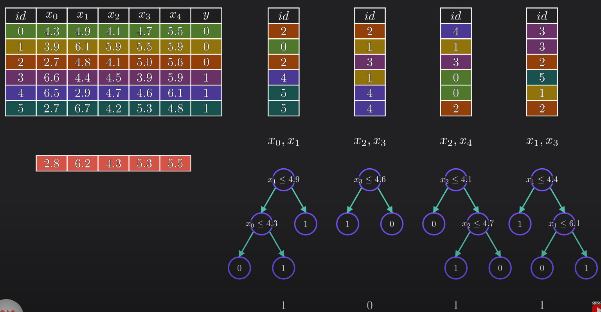

# Random Forest Algorithm

The **Random Forest** is a powerful ensemble learning method used for both classification and regression. It operates by constructing a multitude of decision trees at training time.

## Core Concept
A Random Forest is essentially a collection of many **Decision Trees** working together to improve prediction accuracy. By combining multiple models, it reduces the risk of "overfitting" (where a model learns noise instead of patterns) that often affects individual decision trees [00:02:11].

## How It Works

### 1. Bootstrapping (Data Sampling)
The algorithm creates new versions of the original dataset through a process called **Bootstrapping**:
* **Row Sampling:** New datasets are created by randomly picking rows from the original data *with replacement* (meaning the same row can appear multiple times in one set) [00:03:09].
* **Feature Sampling:** For each tree, only a random subset of columns (features) is selected [00:03:43].

### 2. Building Decision Trees
A decision tree is trained independently for each bootstrapped dataset. Because each tree sees different data and different features, the "Forest" becomes a diverse group of "experts" [00:04:36].

### 3. Aggregation (The Vote)
To make a final prediction for a new data point:
* Every tree in the forest runs its own prediction.
* **Classification:** The final result is decided by **majority vote** [00:05:21].
* **Regression:** The final result is the **average** of all tree outputs [00:07:25].

---

## Technical Jargon: Bagging
The term **Bagging** is a combination of **B**ootstrap + **Agg**regat**ing** [00:05:46]. 

!!! tip "Pro Tip: Square Root Rule"
    When selecting random features for classification, a common best practice is to choose a number of features equal to the square root of the total number of features ($\sqrt{n}$) [00:07:17].

---
**Source:** [Random Forest Algorithm Clearly Explained!](ttps://www.youtube.com/watch?v=ZVR2Way4nwQ)