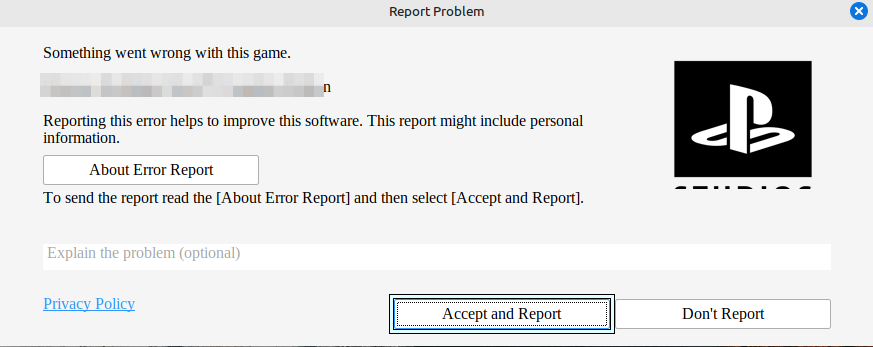
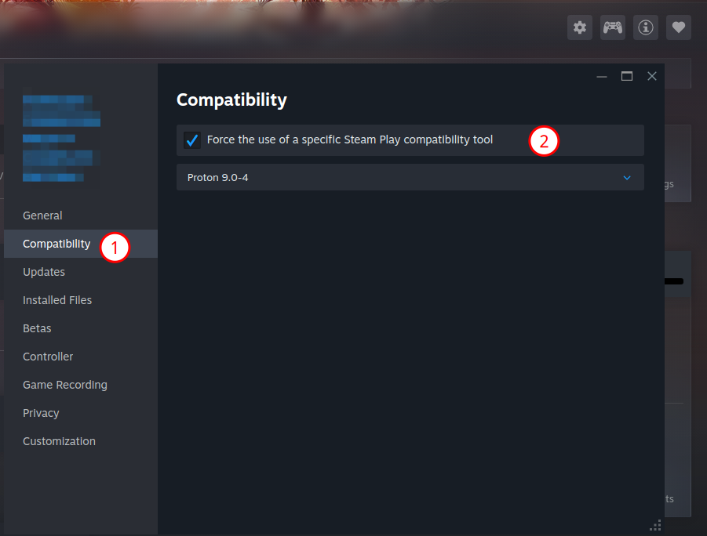

## Quick Tutorial: How to Enable Proton for a Specific Game on Steam

If you're new to Linux after installing Steam, you might get this error :

{ width="300" }
/// caption
Error Steam with Linux when launching a game
///

#### Locate the Game in Your Steam Library

* Open your **Steam client**.
* Go to your **Library**.
* Find the game you want to configure.

#### Access the Game's Properties

* **Right-click** on the game's title in your Library list.
* Select **Properties** from the context menu.

#### Navigate to the Compatibility Tab

* In the *Properties* window, look for the **Compatibility** tab on the left-hand menu.
* **Click** on the **Compatibility** tab.

#### Enable Proton

* Check the box next to **"Force the use of a specific Steam Play compatibility tool."**
* A drop-down menu will appear below the checkbox.
* **Select the desired Proton version** from the drop-down list (usually the latest version, such as **Proton 9.0** or **Proton Experimental**, is recommended). Sometimes, selecting an older Proton version is needed.

{ width="300" }
/// caption
Enabling Proton
///

#### Close and Play

* Close the *Properties* window.
* The game is now set to launch using the selected Proton version.
* **Click the Play button** to start your game with Proton enabled.