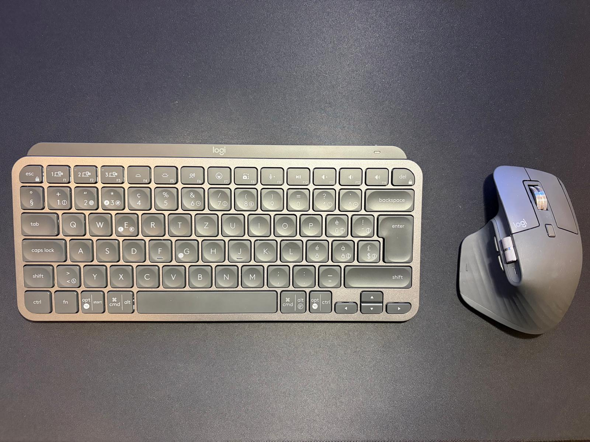

# My Experience: Logitech MX Keys Mini S & MX Master 3S

## Comfort & Build

The level of comfort is **truly impressive**. Both devices feel premium and are built for long hours of use without fatigue.

## MX Keys Mini S

The typing experience is great, but the **backlighting is really average**. It is definitely the weak point of the keyboard and doesn't quite live up to the rest of the build quality.

## MX Master 3S

Nothing to complain about here. The mouse is perfect, especially thanks to the **extensive button customization**. It is incredibly practical for navigating complex workflows.

{ width="300" }
/// caption
My Daily Set Up
///

## Connectivity

The **Logi Bolt** receiver is a lifesaver. It is a massive advantage in corporate environments where Bluetooth is often disabled, providing a stable and secure connection.

## Final Word

Despite the high price, I highly recommend this combo for **anyone working in IT**. The gains in comfort and efficiency are worth the investment.